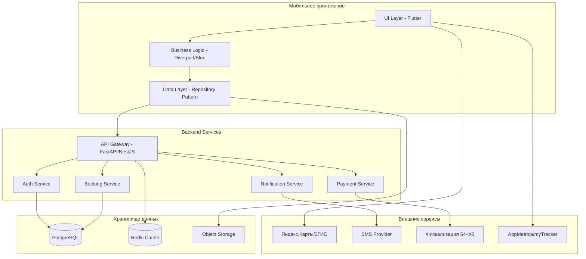

# Дизайн кроссплатформенного приложения бронирования столиков

## Обзор

Кроссплатформенное приложение представляет собой единое решение на Flutter для iOS, Android и Web, интегрированное с бэкенд-системой на FastAPI/NestJS. Архитектура построена на принципах микросервисов с акцентом на безопасность, производительность и соответствие российскому законодательству.

Ключевые технологические решения:
- **Frontend**: Flutter с поддержкой iOS, Android и Web платформ
- **Управление состоянием**: Riverpod/Bloc для всех платформ
- **Backend**: FastAPI (Python) или NestJS (Node.js) с PostgreSQL
- **Платежи**: СБП, карты через YooKassa/CloudPayments
- **Карты**: 
  - Мобильные: Яндекс.Карты/2ГИС SDK
  - Web: Яндекс.Карты JavaScript API или 2ГИС Web API
- **Аналитика**: Яндекс AppMetrica + VK myTracker (с поддержкой Web)

## Архитектура

### Общая архитектура системы



### Архитектура кроссплатформенного приложения

**Слой представления (UI Layer)**
- Экраны и виджеты Flutter с адаптивным дизайном
- Навигация через go_router с поддержкой URL маршрутизации для Web
- Дизайн-система с поддержкой тем и адаптации под платформы
- Анимации на Impeller/Skia (60 FPS) для мобильных, CanvasKit для Web
- Responsive дизайн для различных размеров экранов

**Слой бизнес-логики (Business Logic Layer)**
- Управление состоянием через Riverpod или Bloc (единый код для всех платформ)
- Валидация данных
- Бизнес-правила приложения
- Обработка пользовательских действий с учетом особенностей платформ

**Слой данных (Data Layer)**
- Repository Pattern для абстракции источников данных
- HTTP клиент на dio с retry/cancel логикой
- Локальное кэширование:
  - Мобильные: hive/sqflite
  - Web: IndexedDB через hive_flutter
- Синхронизация оффлайн/онлайн данных с учетом ограничений Web

**Платформо-специфичные адаптации**
- **iOS/Android**: Нативные возможности (камера, push-уведомления, геолокация)
- **Web**: Веб-API (getUserMedia, Web Push, Geolocation API)
- **Общие**: Единая бизнес-логика и API интеграция

## Компоненты и интерфейсы

### Основные модули приложения

#### 1. Модуль аутентификации
```dart
abstract class AuthRepository {
  Future<AuthResult> loginWithPhone(String phone);
  Future<AuthResult> verifyOTP(String phone, String code);
  Future<AuthResult> loginWithEmail(String email, String password);
  Future<AuthResult> loginWithTelegram(String telegramData);
  Future<AuthResult> loginWithYandex(String yandexToken);
  Future<AuthResult> loginWithVK(String vkToken);
  Future<void> logout();
  Stream<AuthState> get authStateChanges;
}

class AuthState {
  final User? user;
  final bool isAuthenticated;
  final String? token;
}
```

#### 2. Модуль поиска и каталога
```dart
abstract class VenueRepository {
  Future<List<Venue>> searchVenues(SearchFilters filters);
  Future<Venue> getVenueDetails(String venueId);
  Future<List<MenuItem>> getVenueMenu(String venueId);
  Future<List<TimeSlot>> getAvailableSlots(String venueId, DateTime date);
}

class SearchFilters {
  final String? query;
  final List<String> categories;
  final double? maxDistance;
  final LatLng? location;
  final bool openNow;
}
```

#### 3. Модуль бронирования
```dart
abstract class BookingRepository {
  Future<Reservation> createReservation(ReservationRequest request);
  Future<List<Reservation>> getUserReservations();
  Future<void> cancelReservation(String reservationId);
  Future<Order> createPreorder(PreorderRequest request);
}

class ReservationRequest {
  final String venueId;
  final DateTime dateTime;
  final int partySize;
  final String? tableType;
  final String? notes;
  final List<PreorderItem>? preorderItems;
}
```

#### 4. Модуль платежей
```dart
abstract class PaymentRepository {
  Future<PaymentResult> processPayment(PaymentRequest request);
  Future<QRPaymentSession> resolveQRToken(String token);
  Future<Receipt> getReceipt(String paymentId);
}

enum PaymentMethod { card, sbp }

class PaymentRequest {
  final String orderId;
  final double amount;
  final PaymentMethod method;
  final double? tip;
  final SplitMode? splitMode;
}
```

### API интерфейсы

#### REST API эндпоинты
```yaml
# Аутентификация
POST /api/v1/auth/sms/request
POST /api/v1/auth/sms/verify
POST /api/v1/auth/telegram
POST /api/v1/auth/yandex
POST /api/v1/auth/vk
POST /api/v1/auth/refresh

# Заведения
GET /api/v1/venues
GET /api/v1/venues/{id}
GET /api/v1/venues/{id}/menu
GET /api/v1/venues/{id}/availability

# Бронирования
POST /api/v1/reservations
GET /api/v1/reservations/me
PATCH /api/v1/reservations/{id}/cancel

# Платежи
POST /api/v1/payments/preorder
POST /api/v1/payments/qr/{token}/pay
GET /api/v1/payments/{id}/receipt

# Профиль
GET /api/v1/me
PATCH /api/v1/me
GET /api/v1/me/favorites
```

## Модели данных

### Основные сущности

#### Пользователь
```dart
class User {
  final String id;
  final String? phone;
  final String? email;
  final String name;
  final String? avatarUrl;
  final double rating;
  final UserPreferences preferences;
  final DateTime createdAt;
}

class UserPreferences {
  final String language; // 'ru' | 'en'
  final ThemeMode theme;
  final NotificationSettings notifications;
  final String? defaultCity;
}
```

#### Заведение
```dart
class Venue {
  final String id;
  final String name;
  final String description;
  final Address address;
  final LatLng coordinates;
  final List<String> photos;
  final double rating;
  final List<String> categories;
  final String cuisine;
  final PriceLevel priceLevel;
  final OpeningHours openingHours;
  final List<Amenity> amenities;
}

class Address {
  final String street;
  final String city;
  final String? building;
  final String? apartment;
}
```

#### Бронирование
```dart
class Reservation {
  final String id;
  final String userId;
  final String venueId;
  final String? tableId;
  final DateTime startTime;
  final DateTime endTime;
  final int partySize;
  final ReservationStatus status;
  final String? notes;
  final double? prepaymentAmount;
  final List<PreorderItem> preorderItems;
}

enum ReservationStatus {
  pending,
  confirmed,
  cancelled,
  noShow,
  completed
}
```

#### Заказ и платеж
```dart
class Order {
  final String id;
  final String? userId;
  final String venueId;
  final String? reservationId;
  final OrderSource source;
  final OrderStatus status;
  final List<OrderItem> items;
  final OrderTotals totals;
  final DateTime createdAt;
}

class OrderTotals {
  final double subtotal;
  final double discountTotal;
  final double tipTotal;
  final double serviceFee;
  final double taxTotal;
  final double total;
}

enum OrderSource { preorder, qr }
enum OrderStatus { pending, authorized, paid, cancelled, refunded }
```

### Схема базы данных

```sql
-- Основные таблицы
CREATE TABLE users (
    id UUID PRIMARY KEY DEFAULT gen_random_uuid(),
    phone VARCHAR(20) UNIQUE,
    email VARCHAR(255) UNIQUE,
    password_hash VARCHAR(255),
    name VARCHAR(100) NOT NULL,
    avatar_url TEXT,
    lang VARCHAR(2) DEFAULT 'ru',
    created_at TIMESTAMP DEFAULT NOW(),
    updated_at TIMESTAMP DEFAULT NOW(),
    is_blocked BOOLEAN DEFAULT FALSE
);

CREATE TABLE venues (
    id UUID PRIMARY KEY DEFAULT gen_random_uuid(),
    name VARCHAR(255) NOT NULL,
    slug VARCHAR(255) UNIQUE,
    city VARCHAR(100) NOT NULL,
    address TEXT NOT NULL,
    lat DECIMAL(10, 8),
    lon DECIMAL(11, 8),
    phone VARCHAR(20),
    description TEXT,
    photos JSONB DEFAULT '[]',
    price_level INTEGER CHECK (price_level BETWEEN 1 AND 4),
    timezone VARCHAR(50) DEFAULT 'Asia/Irkutsk',
    open_hours JSONB,
    amenities JSONB DEFAULT '[]',
    created_at TIMESTAMP DEFAULT NOW(),
    is_active BOOLEAN DEFAULT TRUE
);

CREATE TABLE reservations (
    id UUID PRIMARY KEY DEFAULT gen_random_uuid(),
    user_id UUID REFERENCES users(id),
    venue_id UUID REFERENCES venues(id) NOT NULL,
    table_id UUID REFERENCES tables(id),
    start_at TIMESTAMP NOT NULL,
    end_at TIMESTAMP NOT NULL,
    party_size INTEGER NOT NULL CHECK (party_size > 0),
    status VARCHAR(20) DEFAULT 'pending',
    notes TEXT,
    preorder_total DECIMAL(10, 2) DEFAULT 0,
    policy JSONB DEFAULT '{}',
    created_at TIMESTAMP DEFAULT NOW()
);

CREATE TABLE orders (
    id UUID PRIMARY KEY DEFAULT gen_random_uuid(),
    user_id UUID REFERENCES users(id),
    venue_id UUID REFERENCES venues(id) NOT NULL,
    reservation_id UUID REFERENCES reservations(id),
    table_session_id UUID REFERENCES table_sessions(id),
    source VARCHAR(20) NOT NULL CHECK (source IN ('preorder', 'qr')),
    status VARCHAR(20) DEFAULT 'pending',
    subtotal DECIMAL(10, 2) NOT NULL,
    discount_total DECIMAL(10, 2) DEFAULT 0,
    tip_total DECIMAL(10, 2) DEFAULT 0,
    service_fee DECIMAL(10, 2) DEFAULT 0,
    tax_total DECIMAL(10, 2) DEFAULT 0,
    total DECIMAL(10, 2) NOT NULL,
    currency VARCHAR(3) DEFAULT 'RUB',
    created_at TIMESTAMP DEFAULT NOW(),
    closed_at TIMESTAMP
);
```

## Обработка ошибок

### Стратегия обработки ошибок

#### Сетевые ошибки
- Автоматические повторы с экспоненциальной задержкой
- Кэширование запросов для оффлайн режима
- Graceful degradation функциональности

#### Ошибки платежей
- Детальные коды ошибок от платежных провайдеров
- Сохранение состояния транзакции для восстановления
- Уведомления пользователя о статусе платежа

#### Ошибки валидации
- Клиентская валидация в реальном времени
- Серверная валидация с детальными сообщениями
- Подсветка проблемных полей в UI

```dart
class AppError {
  final String code;
  final String message;
  final String? details;
  final ErrorSeverity severity;
}

enum ErrorSeverity { info, warning, error, critical }

class ErrorHandler {
  static void handleError(AppError error) {
    switch (error.severity) {
      case ErrorSeverity.info:
        _showSnackbar(error.message);
        break;
      case ErrorSeverity.warning:
        _showDialog(error.message);
        break;
      case ErrorSeverity.error:
        _showErrorScreen(error);
        _logError(error);
        break;
      case ErrorSeverity.critical:
        _showCriticalErrorScreen(error);
        _logError(error);
        _reportToCrashlytics(error);
        break;
    }
  }
}
```

## Стратегия тестирования

### Уровни тестирования

#### Unit тесты
- Тестирование бизнес-логики и утилит
- Валидация моделей данных
- Тестирование репозиториев с моками

#### Integration тесты
- Тестирование API интеграций
- Тестирование потоков данных
- Тестирование платежных операций

#### Widget тесты
- Тестирование UI компонентов
- Тестирование пользовательских взаимодействий
- Тестирование навигации

#### E2E тесты
- Критические пользовательские сценарии
- Тестирование на реальных устройствах
- Автоматизированное тестирование релизов

```dart
// Пример unit теста
void main() {
  group('ReservationValidator', () {
    test('should validate correct reservation data', () {
      final reservation = ReservationRequest(
        venueId: 'venue-123',
        dateTime: DateTime.now().add(Duration(hours: 2)),
        partySize: 4,
      );
      
      expect(ReservationValidator.validate(reservation), isTrue);
    });
    
    test('should reject past date reservations', () {
      final reservation = ReservationRequest(
        venueId: 'venue-123',
        dateTime: DateTime.now().subtract(Duration(hours: 1)),
        partySize: 4,
      );
      
      expect(ReservationValidator.validate(reservation), isFalse);
    });
  });
}
```

### Тестовые данные и моки

#### Тестовые заведения
- Набор заведений для разных сценариев
- Различные типы кухонь и ценовых категорий
- Заведения с разными правилами бронирования

#### Тестовые пользователи
- Пользователи с разными рейтингами
- Пользователи с историей no-show
- VIP пользователи с особыми привилегиями

#### Моки внешних сервисов
- Мок платежных провайдеров
- Мок SMS сервиса
- Мок геолокационных сервисов

## Платформо-специфичные особенности

### Web платформа

#### Адаптивный дизайн
- **Десктоп (>1024px)**: Многоколоночный layout, расширенная навигация
- **Планшет (768-1024px)**: Адаптированный интерфейс с боковой панелью
- **Мобильный (<768px)**: Мобильно-ориентированный интерфейс

#### Веб-специфичные функции
```dart
// Адаптация под платформу
class PlatformService {
  static bool get isWeb => kIsWeb;
  static bool get isMobile => !kIsWeb && (Platform.isIOS || Platform.isAndroid);
  
  // QR сканирование
  Future<String?> scanQR() {
    if (isWeb) {
      return _scanQRWeb(); // Использование getUserMedia API
    } else {
      return _scanQRMobile(); // Нативный сканер
    }
  }
  
  // Геолокация
  Future<Position> getCurrentLocation() {
    if (isWeb) {
      return _getLocationWeb(); // Geolocation API
    } else {
      return _getLocationMobile(); // Нативная геолокация
    }
  }
}
```

#### URL маршрутизация для Web
```dart
final router = GoRouter(
  routes: [
    GoRoute(path: '/', builder: (context, state) => HomeScreen()),
    GoRoute(path: '/venues', builder: (context, state) => VenuesScreen()),
    GoRoute(path: '/venue/:id', builder: (context, state) => 
      VenueDetailsScreen(venueId: state.params['id']!)),
    GoRoute(path: '/booking/:venueId', builder: (context, state) => 
      BookingScreen(venueId: state.params['venueId']!)),
    GoRoute(path: '/profile', builder: (context, state) => ProfileScreen()),
    GoRoute(path: '/qr/:token', builder: (context, state) => 
      QRPaymentScreen(token: state.params['token']!)),
  ],
);
```

#### Веб-оптимизации
- **Code splitting**: Lazy loading экранов для уменьшения начального bundle
- **PWA поддержка**: Service Worker для кэширования и оффлайн работы
- **SEO оптимизация**: Meta теги и структурированные данные
- **Производительность**: Tree shaking и минификация для Web build

### Мобильные платформы (iOS/Android)

#### Нативные интеграции
- **Push уведомления**: Firebase Cloud Messaging
- **Биометрическая аутентификация**: local_auth plugin
- **Глубокие ссылки**: App Links (Android) / Universal Links (iOS)
- **Нативные карты**: Яндекс.Карты/2ГИС SDK

#### Платформо-специфичные UI элементы
```dart
class PlatformButton extends StatelessWidget {
  @override
  Widget build(BuildContext context) {
    if (Theme.of(context).platform == TargetPlatform.iOS) {
      return CupertinoButton(...);
    } else {
      return ElevatedButton(...);
    }
  }
}
```

## Безопасность и производительность

### Меры безопасности

#### Аутентификация и авторизация
- JWT токены с коротким временем жизни
- Refresh токены с ротацией
- Rate limiting для API эндпоинтов
- Защита от брутфорс атак на OTP

#### Защита данных
- Шифрование PII в базе данных
- HTTPS для всех соединений
- Валидация и санитизация пользовательского ввода
- Защита от SQL инъекций через ORM

#### Соответствие законодательству
- Хранение персональных данных в РФ (ФЗ-152)
- Фискализация согласно 54-ФЗ
- Аудит действий пользователей
- Возможность удаления персональных данных

### Оптимизация производительности

#### Мобильное приложение
- Lazy loading изображений
- Пагинация списков
- Кэширование часто используемых данных
- Оптимизация анимаций для 60 FPS

#### Backend
- Индексы базы данных для частых запросов
- Кэширование в Redis
- Оптимизация SQL запросов
- CDN для статических ресурсов

#### Мониторинг
- Метрики производительности в реальном времени
- Алерты на критические ошибки
- Трекинг пользовательских сессий
- A/B тестирование новых функций

```dart
// Пример оптимизации загрузки изображений
class OptimizedImage extends StatelessWidget {
  final String imageUrl;
  final double? width;
  final double? height;
  
  @override
  Widget build(BuildContext context) {
    return CachedNetworkImage(
      imageUrl: imageUrl,
      width: width,
      height: height,
      placeholder: (context, url) => ShimmerPlaceholder(),
      errorWidget: (context, url, error) => DefaultImagePlaceholder(),
      memCacheWidth: width?.toInt(),
      memCacheHeight: height?.toInt(),
    );
  }
}
```

Этот дизайн обеспечивает масштабируемую, безопасную и производительную архитектуру для мобильного приложения бронирования столиков, соответствующую всем требованиям российского законодательства и современным стандартам разработки.