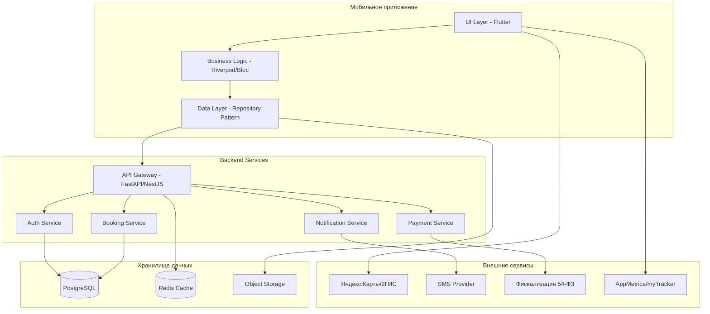

# Дизайн кроссплатформенного приложения бронирования столиков

## Обзор

Кроссплатформенное приложение представляет собой единое решение на Flutter для iOS, Android и Web, интегрированное с бэкенд-системой на FastAPI/NestJS. Архитектура построена на принципах микросервисов с акцентом на безопасность, производительность и соответствие российскому законодательству.

Ключевые технологические решения:
- **Frontend**: Flutter с поддержкой iOS, Android и Web платформ
- **Управление состоянием**: Riverpod/Bloc для всех платформ
- **Backend**: FastAPI (Python) или NestJS (Node.js) с PostgreSQL
- **Платежи**: СБП, карты через YooKassa/CloudPayments
- **Карты**: 
  - Мобильные: Яндекс.Карты/2ГИС SDK
  - Web: Яндекс.Карты JavaScript API или 2ГИС Web API
- **Аналитика**: Яндекс AppMetrica + VK myTracker (с поддержкой Web)

## Архитектура

### Общая архитектура системы



### Архитектура кроссплатформенного приложения

**Слой представления (UI Layer)**
- Экраны и виджеты Flutter с адаптивным дизайном
- Навигация через go_router с поддержкой URL маршрутизации для Web
- Дизайн-система с поддержкой тем и адаптации под платформы
- Анимации на Impeller/Skia (60 FPS) для мобильных, CanvasKit для Web
- Responsive дизайн для различных размеров экранов

**Слой бизнес-логики (Business Logic Layer)**
- Управление состоянием через Riverpod или Bloc (единый код для всех платформ)
- Валидация данных
- Бизнес-правила приложения
- Обработка пользовательских действий с учетом особенностей платформ

**Слой данных (Data Layer)**
- Repository Pattern для абстракции источников данных
- HTTP клиент на dio с retry/cancel логикой
- Локальное кэширование:
  - Мобильные: hive/sqflite
  - Web: IndexedDB через hive_flutter
- Синхронизация оффлайн/онлайн данных с учетом ограничений Web

**Платформо-специфичные адаптации**
- **iOS/Android**: Нативные возможности (камера, push-уведомления, геолокация)
- **Web**: Веб-API (getUserMedia, Web Push, Geolocation API)
- **Общие**: Единая бизнес-логика и API интеграция

## Компоненты и интерфейсы

### Основные модули приложения

#### 1. Модуль аутентификации
```dart
abstract class AuthRepository {
  Future<AuthResult> loginWithPhone(String phone);
  Future<AuthResult> verifyOTP(String phone, String code);
  Future<AuthResult> loginWithEmail(String email, String password);
  Future<AuthResult> loginWithTelegram(String telegramData);
  Future<AuthResult> loginWithYandex(String yandexToken);
  Future<AuthResult> loginWithVK(String vkToken);
  Future<void> logout();
  Stream<AuthState> get authStateChanges;
}

class AuthState {
  final User? user;
  final bool isAuthenticated;
  final String? token;
}
```

#### 2. Модуль поиска и каталога
```dart
abstract class VenueRepository {
  Future<List<Venue>> searchVenues(SearchFilters filters);
  Future<Venue> getVenueDetails(String venueId);
  Future<List<MenuItem>> getVenueMenu(String venueId);
  Future<List<TimeSlot>> getAvailableSlots(String venueId, DateTime date);
}

class SearchFilters {
  final String? query;
  final List<String> categories;
  final double? maxDistance;
  final LatLng? location;
  final bool openNow;
}
```

#### 3. Модуль бронирования
```dart
abstract class BookingRepository {
  Future<Reservation> createReservation(ReservationRequest request);
  Future<List<Reservation>> getUserReservations();
  Future<void> cancelReservation(String reservationId);
  Future<Order> createPreorder(PreorderRequest request);
}

class ReservationRequest {
  final String venueId;
  final DateTime dateTime;
  final int partySize;
  final String? tableType;
  final String? notes;
  final List<PreorderItem>? preorderItems;
}
```

#### 4. Модуль платежей
```dart
abstract class PaymentRepository {
  Future<PaymentResult> processPayment(PaymentRequest request);
  Future<QRPaymentSession> resolveQRToken(String token);
  Future<Receipt> getReceipt(String paymentId);
}

enum PaymentMethod { card, sbp }

class PaymentRequest {
  final String orderId;
  final double amount;
  final PaymentMethod method;
  final double? tip;
  final SplitMode? splitMode;
}
```

### API интерфейсы

#### REST API эндпоинты
```yaml
# Аутентификация
POST /api/v1/auth/sms/request
POST /api/v1/auth/sms/verify
POST /api/v1/auth/telegram
POST /api/v1/auth/yandex
POST /api/v1/auth/vk
POST /api/v1/auth/refresh

# Заведения
GET /api/v1/venues
GET /api/v1/venues/{id}
GET /api/v1/venues/{id}/menu
GET /api/v1/venues/{id}/availability

# Бронирования
POST /api/v1/reservations
GET /api/v1/reservations/me
PATCH /api/v1/reservations/{id}/cancel

# Платежи
POST /api/v1/payments/preorder
POST /api/v1/payments/qr/{token}/pay
GET /api/v1/payments/{id}/receipt

# Профиль
GET /api/v1/me
PATCH /api/v1/me
GET /api/v1/me/favorites
```

## Модели данных

### Основные сущности

#### Пользователь
```dart
class User {
  final String id;
  final String? phone;
  final String? email;
  final String name;
  final String? avatarUrl;
  final double rating;
  final UserPreferences preferences;
  final DateTime createdAt;
}

class UserPreferences {
  final String language; // 'ru' | 'en'
  final ThemeMode theme;
  final NotificationSettings notifications;
  final String? defaultCity;
}
```

#### Заведение
```dart
class Venue {
  final String id;
  final String name;
  final String description;
  final Address address;
  final LatLng coordinates;
  final List<String> photos;
  final double rating;
  final List<String> categories;
  final String cuisine;
  final PriceLevel priceLevel;
  final OpeningHours openingHours;
  final List<Amenity> amenities;
}

class Address {
  final String street;
  final String city;
  final String? building;
  final String? apartment;
}
```

#### Бронирование
```dart
class Reservation {
  final String id;
  final String userId;
  final String venueId;
  final String? tableId;
  final DateTime startTime;
  final DateTime endTime;
  final int partySize;
  final ReservationStatus status;
  final String? notes;
  final double? prepaymentAmount;
  final List<PreorderItem> preorderItems;
}

enum ReservationStatus {
  pending,
  confirmed,
  cancelled,
  noShow,
  completed
}
```

#### Заказ и платеж
```dart
class Order {
  final String id;
  final String? userId;
  final String venueId;
  final String? reservationId;
  final OrderSource source;
  final OrderStatus status;
  final List<OrderItem> items;
  final OrderTotals totals;
  final DateTime createdAt;
}

class OrderTotals {
  final double subtotal;
  final double discountTotal;
  final double tipTotal;
  final double serviceFee;
  final double taxTotal;
  final double total;
}

enum OrderSource { preorder, qr }
enum OrderStatus { pending, authorized, paid, cancelled, refunded }
```

### Схема базы данных

```sql
-- Основные таблицы
CREATE TABLE users (
    id UUID PRIMARY KEY DEFAULT gen_random_uuid(),
    phone VARCHAR(20) UNIQUE,
    email VARCHAR(255) UNIQUE,
    password_hash VARCHAR(255),
    name VARCHAR(100) NOT NULL,
    avatar_url TEXT,
    lang VARCHAR(2) DEFAULT 'ru',
    created_at TIMESTAMP DEFAULT NOW(),
    updated_at TIMESTAMP DEFAULT NOW(),
    is_blocked BOOLEAN DEFAULT FALSE
);

CREATE TABLE venues (
    id UUID PRIMARY KEY DEFAULT gen_random_uuid(),
    name VARCHAR(255) NOT NULL,
    slug VARCHAR(255) UNIQUE,
    city VARCHAR(100) NOT NULL,
    address TEXT NOT NULL,
    lat DECIMAL(10, 8),
    lon DECIMAL(11, 8),
    phone VARCHAR(20),
    description TEXT,
    photos JSONB DEFAULT '[]',
    price_level INTEGER CHECK (price_level BETWEEN 1 AND 4),
    timezone VARCHAR(50) DEFAULT 'Asia/Irkutsk',
    open_hours JSONB,
    amenities JSONB DEFAULT '[]',
    created_at TIMESTAMP DEFAULT NOW(),
    is_active BOOLEAN DEFAULT TRUE
);

CREATE TABLE reservations (
    id UUID PRIMARY KEY DEFAULT gen_random_uuid(),
    user_id UUID REFERENCES users(id),
    venue_id UUID REFERENCES venues(id) NOT NULL,
    table_id UUID REFERENCES tables(id),
    start_at TIMESTAMP NOT NULL,
    end_at TIMESTAMP NOT NULL,
    party_size INTEGER NOT NULL CHECK (party_size > 0),
    status VARCHAR(20) DEFAULT 'pending',
    notes TEXT,
    preorder_total DECIMAL(10, 2) DEFAULT 0,
    policy JSONB DEFAULT '{}',
    created_at TIMESTAMP DEFAULT NOW()
);

CREATE TABLE orders (
    id UUID PRIMARY KEY DEFAULT gen_random_uuid(),
    user_id UUID REFERENCES users(id),
    venue_id UUID REFERENCES venues(id) NOT NULL,
    reservation_id UUID REFERENCES reservations(id),
    table_session_id UUID REFERENCES table_sessions(id),
    source VARCHAR(20) NOT NULL CHECK (source IN ('preorder', 'qr')),
    status VARCHAR(20) DEFAULT 'pending',
    subtotal DECIMAL(10, 2) NOT NULL,
    discount_total DECIMAL(10, 2) DEFAULT 0,
    tip_total DECIMAL(10, 2) DEFAULT 0,
    service_fee DECIMAL(10, 2) DEFAULT 0,
    tax_total DECIMAL(10, 2) DEFAULT 0,
    total DECIMAL(10, 2) NOT NULL,
    currency VARCHAR(3) DEFAULT 'RUB',
    created_at TIMESTAMP DEFAULT NOW(),
    closed_at TIMESTAMP
);
```

## Обработка ошибок

### Стратегия обработки ошибок

#### Сетевые ошибки
- Автоматические повторы с экспоненциальной задержкой
- Кэширование запросов для оффлайн режима
- Graceful degradation функциональности

#### Ошибки платежей
- Детальные коды ошибок от платежных провайдеров
- Сохранение состояния транзакции для восстановления
- Уведомления пользователя о статусе платежа

#### Ошибки валидации
- Клиентская валидация в реальном времени
- Серверная валидация с детальными сообщениями
- Подсветка проблемных полей в UI

```dart
class AppError {
  final String code;
  final String message;
  final String? details;
  final ErrorSeverity severity;
}

enum ErrorSeverity { info, warning, error, critical }

class ErrorHandler {
  static void handleError(AppError error) {
    switch (error.severity) {
      case ErrorSeverity.info:
        _showSnackbar(error.message);
        break;
      case ErrorSeverity.warning:
        _showDialog(error.message);
        break;
      case ErrorSeverity.error:
        _showErrorScreen(error);
        _logError(error);
        break;
      case ErrorSeverity.critical:
        _showCriticalErrorScreen(error);
        _logError(error);
        _reportToCrashlytics(error);
        break;
    }
  }
}
```

## Стратегия тестирования

### Уровни тестирования

#### Unit тесты
- Тестирование бизнес-логики и утилит
- Валидация моделей данных
- Тестирование репозиториев с моками

#### Integration тесты
- Тестирование API интеграций
- Тестирование потоков данных
- Тестирование платежных операций

#### Widget тесты
- Тестирование UI компонентов
- Тестирование пользовательских взаимодействий
- Тестирование навигации

#### E2E тесты
- Критические пользовательские сценарии
- Тестирование на реальных устройствах
- Автоматизированное тестирование релизов

```dart
// Пример unit теста
void main() {
  group('ReservationValidator', () {
    test('should validate correct reservation data', () {
      final reservation = ReservationRequest(
        venueId: 'venue-123',
        dateTime: DateTime.now().add(Duration(hours: 2)),
        partySize: 4,
      );
      
      expect(ReservationValidator.validate(reservation), isTrue);
    });
    
    test('should reject past date reservations', () {
      final reservation = ReservationRequest(
        venueId: 'venue-123',
        dateTime: DateTime.now().subtract(Duration(hours: 1)),
        partySize: 4,
      );
      
      expect(ReservationValidator.validate(reservation), isFalse);
    });
  });
}
```

### Тестовые данные и моки

#### Тестовые заведения
- Набор заведений для разных сценариев
- Различные типы кухонь и ценовых категорий
- Заведения с разными правилами бронирования

#### Тестовые пользователи
- Пользователи с разными рейтингами
- Пользователи с историей no-show
- VIP пользователи с особыми привилегиями

#### Моки внешних сервисов
- Мок платежных провайдеров
- Мок SMS сервиса
- Мок геолокационных сервисов

## Дизайн-система

Дизайн-система основана на современном, минималистичном подходе с акцентом на качественные изображения, четкую типографику и интуитивную навигацию. Система поддерживает светлую и темную темы с плавными переходами между ними.

### Принципы дизайна

1. **Визуальная иерархия**: Четкое разделение контента с помощью размеров, цветов и отступов
2. **Качественные изображения**: Высококачественные фотографии заведений в соотношении 16:9
3. **Читаемость**: Контрастные цвета и оптимальные размеры шрифтов
4. **Консистентность**: Единообразные компоненты на всех экранах
5. **Адаптивность**: Корректное отображение на всех размерах экранов

### Цветовая палитра

#### Светлая тема
```dart
class LightThemeColors {
  // Основные цвета
  static const Color primary = Color(0xFF000000);        // Чистый черный для заголовков
  static const Color primarySoft = Color(0xFF1A1A1A);    // Мягкий черный для текста
  static const Color secondary = Color(0xFF6B7280);      // Серый для вторичного текста
  static const Color accent = Color(0xFF2563EB);         // Синий для акцентов и кнопок
  
  // Фоны
  static const Color background = Color(0xFFFFFFFF);     // Белый фон
  static const Color surface = Color(0xFFFAFAFA);       // Светло-серый для поверхностей
  static const Color cardBackground = Color(0xFFFFFFFF); // Белый для карточек
  static const Color overlay = Color(0x80000000);        // Полупрозрачный для оверлеев
  
  // Текст
  static const Color textPrimary = Color(0xFF000000);    // Основной текст
  static const Color textSecondary = Color(0xFF6B7280);  // Вторичный текст
  static const Color textTertiary = Color(0xFF9CA3AF);   // Третичный текст
  static const Color textOnDark = Color(0xFFFFFFFF);     // Текст на темном фоне
  
  // Состояния
  static const Color success = Color(0xFF059669);        // Зеленый для успеха
  static const Color warning = Color(0xFFD97706);        // Оранжевый для предупреждений
  static const Color error = Color(0xFFDC2626);          // Красный для ошибок
  static const Color info = Color(0xFF2563EB);           // Синий для информации
  
  // Рейтинг и звезды
  static const Color ratingActive = Color(0xFFFBBF24);   // Золотой для активных звезд
  static const Color ratingInactive = Color(0xFFE5E7EB); // Серый для неактивных звезд
  
  // Границы и разделители
  static const Color border = Color(0xFFE5E7EB);         // Светло-серый для границ
  static const Color divider = Color(0xFFF3F4F6);        // Очень светлый для разделителей
  
  // Кнопки
  static const Color buttonPrimary = Color(0xFF000000);   // Черная основная кнопка
  static const Color buttonSecondary = Color(0xFFF9FAFB); // Светлая вторичная кнопка
  static const Color buttonDisabled = Color(0xFFE5E7EB);  // Отключенная кнопка
}
```

#### Темная тема
```dart
class DarkThemeColors {
  // Основные цвета
  static const Color primary = Color(0xFFFFFFFF);        // Белый для заголовков
  static const Color primarySoft = Color(0xFFF9FAFB);    // Мягкий белый для текста
  static const Color secondary = Color(0xFF9CA3AF);      // Светло-серый для вторичного текста
  static const Color accent = Color(0xFF3B82F6);         // Синий для акцентов
  
  // Фоны
  static const Color background = Color(0xFF000000);     // Черный фон
  static const Color surface = Color(0xFF111111);        // Темно-серый для поверхностей
  static const Color cardBackground = Color(0xFF1F1F1F); // Темно-серый для карточек
  static const Color overlay = Color(0x80000000);        // Полупрозрачный для оверлеев
  
  // Текст
  static const Color textPrimary = Color(0xFFFFFFFF);    // Основной текст
  static const Color textSecondary = Color(0xFFD1D5DB);  // Вторичный текст
  static const Color textTertiary = Color(0xFF9CA3AF);   // Третичный текст
  static const Color textOnDark = Color(0xFF000000);     // Текст на светлом фоне
  
  // Состояния
  static const Color success = Color(0xFF10B981);        // Зеленый для успеха
  static const Color warning = Color(0xFFF59E0B);        // Оранжевый для предупреждений
  static const Color error = Color(0xFFF87171);          // Красный для ошибок
  static const Color info = Color(0xFF3B82F6);           // Синий для информации
  
  // Рейтинг и звезды
  static const Color ratingActive = Color(0xFFFBBF24);   // Золотой для активных звезд
  static const Color ratingInactive = Color(0xFF374151); // Темно-серый для неактивных звезд
  
  // Границы и разделители
  static const Color border = Color(0xFF374151);         // Темно-серый для границ
  static const Color divider = Color(0xFF1F2937);        // Очень темный для разделителей
  
  // Кнопки
  static const Color buttonPrimary = Color(0xFFFFFFFF);   // Белая основная кнопка
  static const Color buttonSecondary = Color(0xFF374151); // Темная вторичная кнопка
  static const Color buttonDisabled = Color(0xFF4B5563);  // Отключенная кнопка
}
```

### Типографика

Типографическая система основана на системных шрифтах для обеспечения оптимальной читаемости и производительности на всех платформах.

```dart
class AppTextStyles {
  // Основной шрифт
  static const String fontFamily = 'SF Pro Display'; // iOS
  static const String fontFamilyAndroid = 'Roboto';  // Android
  static const String fontFamilyWeb = 'Inter';       // Web
  
  // Заголовки экранов
  static const TextStyle screenTitle = TextStyle(
    fontSize: 28,
    fontWeight: FontWeight.w700,
    height: 1.2,
    letterSpacing: -0.5,
  );
  
  static const TextStyle sectionTitle = TextStyle(
    fontSize: 22,
    fontWeight: FontWeight.w600,
    height: 1.3,
    letterSpacing: -0.3,
  );
  
  static const TextStyle cardTitle = TextStyle(
    fontSize: 18,
    fontWeight: FontWeight.w600,
    height: 1.4,
    letterSpacing: -0.2,
  );
  
  // Названия заведений
  static const TextStyle venueName = TextStyle(
    fontSize: 20,
    fontWeight: FontWeight.w600,
    height: 1.2,
    letterSpacing: -0.3,
  );
  
  static const TextStyle venueNameLarge = TextStyle(
    fontSize: 24,
    fontWeight: FontWeight.w700,
    height: 1.2,
    letterSpacing: -0.4,
  );
  
  // Основной текст
  static const TextStyle bodyLarge = TextStyle(
    fontSize: 16,
    fontWeight: FontWeight.w400,
    height: 1.5,
    letterSpacing: 0,
  );
  
  static const TextStyle bodyMedium = TextStyle(
    fontSize: 14,
    fontWeight: FontWeight.w400,
    height: 1.4,
    letterSpacing: 0,
  );
  
  static const TextStyle bodySmall = TextStyle(
    fontSize: 12,
    fontWeight: FontWeight.w400,
    height: 1.3,
    letterSpacing: 0.1,
  );
  
  // Метаинформация (рейтинг, тип кухни, цены)
  static const TextStyle metadata = TextStyle(
    fontSize: 14,
    fontWeight: FontWeight.w500,
    height: 1.3,
    letterSpacing: 0,
  );
  
  static const TextStyle metadataSmall = TextStyle(
    fontSize: 12,
    fontWeight: FontWeight.w500,
    height: 1.2,
    letterSpacing: 0.1,
  );
  
  // Цены
  static const TextStyle price = TextStyle(
    fontSize: 16,
    fontWeight: FontWeight.w600,
    height: 1.2,
    letterSpacing: -0.1,
  );
  
  static const TextStyle priceLarge = TextStyle(
    fontSize: 20,
    fontWeight: FontWeight.w700,
    height: 1.2,
    letterSpacing: -0.2,
  );
  
  // Рейтинг
  static const TextStyle rating = TextStyle(
    fontSize: 14,
    fontWeight: FontWeight.w600,
    height: 1.2,
    letterSpacing: 0,
  );
  
  // Кнопки
  static const TextStyle buttonLarge = TextStyle(
    fontSize: 16,
    fontWeight: FontWeight.w600,
    height: 1.2,
    letterSpacing: 0,
  );
  
  static const TextStyle buttonMedium = TextStyle(
    fontSize: 14,
    fontWeight: FontWeight.w600,
    height: 1.2,
    letterSpacing: 0,
  );
  
  static const TextStyle buttonSmall = TextStyle(
    fontSize: 12,
    fontWeight: FontWeight.w600,
    height: 1.2,
    letterSpacing: 0.1,
  );
  
  // Навигация и табы
  static const TextStyle tabLabel = TextStyle(
    fontSize: 12,
    fontWeight: FontWeight.w500,
    height: 1.2,
    letterSpacing: 0.1,
  );
  
  static const TextStyle navigationTitle = TextStyle(
    fontSize: 17,
    fontWeight: FontWeight.w600,
    height: 1.2,
    letterSpacing: -0.2,
  );
  
  // Подписи и описания
  static const TextStyle caption = TextStyle(
    fontSize: 11,
    fontWeight: FontWeight.w400,
    height: 1.3,
    letterSpacing: 0.1,
  );
  
  static const TextStyle description = TextStyle(
    fontSize: 14,
    fontWeight: FontWeight.w400,
    height: 1.5,
    letterSpacing: 0,
  );
}
```

### Компоненты UI

#### Карточка заведения (основная)
```dart
class VenueCard extends StatelessWidget {
  final Venue venue;
  final VoidCallback? onTap;
  final bool isCompact;
  
  const VenueCard({
    Key? key,
    required this.venue,
    this.onTap,
    this.isCompact = false,
  }) : super(key: key);
  
  @override
  Widget build(BuildContext context) {
    final theme = Theme.of(context);
    final isDark = theme.brightness == Brightness.dark;
    
    return Container(
      decoration: BoxDecoration(
        color: isDark ? DarkThemeColors.cardBackground : LightThemeColors.cardBackground,
        borderRadius: BorderRadius.circular(16),
        boxShadow: [
          BoxShadow(
            color: Colors.black.withOpacity(isDark ? 0.3 : 0.08),
            blurRadius: 12,
            offset: Offset(0, 4),
          ),
        ],
      ),
      child: Material(
        color: Colors.transparent,
        child: InkWell(
          onTap: onTap,
          borderRadius: BorderRadius.circular(16),
          child: Column(
            crossAxisAlignment: CrossAxisAlignment.start,
            children: [
              // Изображение заведения с градиентом
              Stack(
                children: [
                  ClipRRect(
                    borderRadius: BorderRadius.vertical(top: Radius.circular(16)),
                    child: AspectRatio(
                      aspectRatio: 16 / 9,
                      child: CachedNetworkImage(
                        imageUrl: venue.mainPhoto,
                        fit: BoxFit.cover,
                        placeholder: (context, url) => VenueImageSkeleton(),
                        errorWidget: (context, url, error) => VenueImagePlaceholder(),
                      ),
                    ),
                  ),
                  // Градиент для лучшей читаемости текста на изображении
                  Positioned(
                    bottom: 0,
                    left: 0,
                    right: 0,
                    child: Container(
                      height: 60,
                      decoration: BoxDecoration(
                        borderRadius: BorderRadius.vertical(top: Radius.circular(16)),
                        gradient: LinearGradient(
                          begin: Alignment.topCenter,
                          end: Alignment.bottomCenter,
                          colors: [
                            Colors.transparent,
                            Colors.black.withOpacity(0.3),
                          ],
                        ),
                      ),
                    ),
                  ),
                ],
              ),
              
              // Контент карточки
              Padding(
                padding: EdgeInsets.all(16),
                child: Column(
                  crossAxisAlignment: CrossAxisAlignment.start,
                  children: [
                    // Название заведения
                    Text(
                      venue.name,
                      style: AppTextStyles.venueName.copyWith(
                        color: isDark ? DarkThemeColors.textPrimary : LightThemeColors.textPrimary,
                      ),
                      maxLines: 1,
                      overflow: TextOverflow.ellipsis,
                    ),
                    
                    SizedBox(height: 6),
                    
                    // Рейтинг, отзывы и тип кухни
                    Row(
                      children: [
                        RatingStars(rating: venue.rating, size: 14),
                        SizedBox(width: 6),
                        Text(
                          venue.rating.toStringAsFixed(1),
                          style: AppTextStyles.metadata.copyWith(
                            color: isDark ? DarkThemeColors.textPrimary : LightThemeColors.textPrimary,
                            fontWeight: FontWeight.w600,
                          ),
                        ),
                        SizedBox(width: 4),
                        Text(
                          '(${venue.reviewCount})',
                          style: AppTextStyles.metadataSmall.copyWith(
                            color: isDark ? DarkThemeColors.textSecondary : LightThemeColors.textSecondary,
                          ),
                        ),
                        SizedBox(width: 12),
                        Expanded(
                          child: Text(
                            '${venue.cuisine} • ${_getPriceLevelText(venue.priceLevel)}',
                            style: AppTextStyles.metadata.copyWith(
                              color: isDark ? DarkThemeColors.textSecondary : LightThemeColors.textSecondary,
                            ),
                            maxLines: 1,
                            overflow: TextOverflow.ellipsis,
                          ),
                        ),
                      ],
                    ),
                    
                    if (!isCompact) ...[
                      SizedBox(height: 12),
                      
                      // Время и статус
                      Row(
                        children: [
                          Container(
                            padding: EdgeInsets.symmetric(horizontal: 8, vertical: 4),
                            decoration: BoxDecoration(
                              color: isDark ? DarkThemeColors.surface : LightThemeColors.surface,
                              borderRadius: BorderRadius.circular(6),
                            ),
                            child: Text(
                              'Сегодня',
                              style: AppTextStyles.metadataSmall.copyWith(
                                color: isDark ? DarkThemeColors.textSecondary : LightThemeColors.textSecondary,
                              ),
                            ),
                          ),
                          SizedBox(width: 8),
                          Container(
                            padding: EdgeInsets.symmetric(horizontal: 8, vertical: 4),
                            decoration: BoxDecoration(
                              color: isDark ? DarkThemeColors.surface : LightThemeColors.surface,
                              borderRadius: BorderRadius.circular(6),
                            ),
                            child: Text(
                              '19:30',
                              style: AppTextStyles.metadataSmall.copyWith(
                                color: isDark ? DarkThemeColors.textPrimary : LightThemeColors.textPrimary,
                                fontWeight: FontWeight.w600,
                              ),
                            ),
                          ),
                          Spacer(),
                          Icon(
                            Icons.arrow_forward_ios,
                            size: 12,
                            color: isDark ? DarkThemeColors.textTertiary : LightThemeColors.textTertiary,
                          ),
                        ],
                      ),
                      
                      SizedBox(height: 16),
                      
                      // Кнопка бронирования
                      SizedBox(
                        width: double.infinity,
                        child: ElevatedButton(
                          onPressed: onTap,
                          style: ElevatedButton.styleFrom(
                            backgroundColor: isDark ? DarkThemeColors.buttonPrimary : LightThemeColors.buttonPrimary,
                            foregroundColor: isDark ? DarkThemeColors.textOnDark : LightThemeColors.textOnDark,
                            padding: EdgeInsets.symmetric(vertical: 14),
                            shape: RoundedRectangleBorder(
                              borderRadius: BorderRadius.circular(12),
                            ),
                            elevation: 0,
                          ),
                          child: Text(
                            'Забронировать',
                            style: AppTextStyles.buttonMedium,
                          ),
                        ),
                      ),
                    ],
                  ],
                ),
              ),
            ],
          ),
        ),
      ),
    );
  }
  
  String _getPriceLevelText(int level) {
    return '\$' * level;
  }
}
```

#### Компактная карточка заведения для списков
```dart
class CompactVenueCard extends StatelessWidget {
  final Venue venue;
  final VoidCallback? onTap;
  
  @override
  Widget build(BuildContext context) {
    final theme = Theme.of(context);
    final isDark = theme.brightness == Brightness.dark;
    
    return Container(
      margin: EdgeInsets.symmetric(horizontal: 16, vertical: 6),
      decoration: BoxDecoration(
        color: isDark ? DarkThemeColors.cardBackground : LightThemeColors.cardBackground,
        borderRadius: BorderRadius.circular(12),
        border: Border.all(
          color: isDark ? DarkThemeColors.border : LightThemeColors.border,
          width: 0.5,
        ),
      ),
      child: Material(
        color: Colors.transparent,
        child: InkWell(
          onTap: onTap,
          borderRadius: BorderRadius.circular(12),
          child: Padding(
            padding: EdgeInsets.all(12),
            child: Row(
              children: [
                // Изображение
                ClipRRect(
                  borderRadius: BorderRadius.circular(8),
                  child: SizedBox(
                    width: 60,
                    height: 60,
                    child: CachedNetworkImage(
                      imageUrl: venue.mainPhoto,
                      fit: BoxFit.cover,
                      placeholder: (context, url) => Container(
                        color: isDark ? DarkThemeColors.surface : LightThemeColors.surface,
                      ),
                    ),
                  ),
                ),
                
                SizedBox(width: 12),
                
                // Контент
                Expanded(
                  child: Column(
                    crossAxisAlignment: CrossAxisAlignment.start,
                    children: [
                      Text(
                        venue.name,
                        style: AppTextStyles.cardTitle.copyWith(
                          color: isDark ? DarkThemeColors.textPrimary : LightThemeColors.textPrimary,
                        ),
                        maxLines: 1,
                        overflow: TextOverflow.ellipsis,
                      ),
                      
                      SizedBox(height: 4),
                      
                      Row(
                        children: [
                          RatingStars(rating: venue.rating, size: 12),
                          SizedBox(width: 4),
                          Text(
                            venue.rating.toStringAsFixed(1),
                            style: AppTextStyles.metadataSmall.copyWith(
                              color: isDark ? DarkThemeColors.textSecondary : LightThemeColors.textSecondary,
                            ),
                          ),
                          SizedBox(width: 8),
                          Text(
                            venue.cuisine,
                            style: AppTextStyles.metadataSmall.copyWith(
                              color: isDark ? DarkThemeColors.textTertiary : LightThemeColors.textTertiary,
                            ),
                          ),
                        ],
                      ),
                    ],
                  ),
                ),
                
                // Стрелка
                Icon(
                  Icons.arrow_forward_ios,
                  size: 14,
                  color: isDark ? DarkThemeColors.textTertiary : LightThemeColors.textTertiary,
                ),
              ],
            ),
          ),
        ),
      ),
    );
  }
}
```

#### Рейтинг со звездочками
```dart
class RatingStars extends StatelessWidget {
  final double rating;
  final double size;
  final Color? activeColor;
  final Color? inactiveColor;
  
  const RatingStars({
    Key? key,
    required this.rating,
    this.size = 16,
    this.activeColor,
    this.inactiveColor,
  }) : super(key: key);
  
  @override
  Widget build(BuildContext context) {
    final theme = Theme.of(context);
    final isDark = theme.brightness == Brightness.dark;
    
    final activeStarColor = activeColor ?? 
      (isDark ? DarkThemeColors.ratingActive : LightThemeColors.ratingActive);
    final inactiveStarColor = inactiveColor ?? 
      (isDark ? DarkThemeColors.ratingInactive : LightThemeColors.ratingInactive);
    
    return Row(
      mainAxisSize: MainAxisSize.min,
      children: List.generate(5, (index) {
        IconData iconData;
        Color iconColor;
        
        if (index < rating.floor()) {
          iconData = Icons.star_rounded;
          iconColor = activeStarColor;
        } else if (index < rating) {
          iconData = Icons.star_half_rounded;
          iconColor = activeStarColor;
        } else {
          iconData = Icons.star_outline_rounded;
          iconColor = inactiveStarColor;
        }
        
        return Icon(
          iconData,
          color: iconColor,
          size: size,
        );
      }),
    );
  }
}
```

#### Индикатор ценовой категории
```dart
class PriceLevelIndicator extends StatelessWidget {
  final int level;
  final double size;
  
  const PriceLevelIndicator({
    Key? key,
    required this.level,
    this.size = 12,
  }) : super(key: key);
  
  @override
  Widget build(BuildContext context) {
    final theme = Theme.of(context);
    final isDark = theme.brightness == Brightness.dark;
    
    return Row(
      mainAxisSize: MainAxisSize.min,
      children: List.generate(4, (index) {
        final isActive = index < level;
        return Text(
          '\$',
          style: TextStyle(
            fontSize: size,
            fontWeight: FontWeight.w600,
            color: isActive 
              ? (isDark ? DarkThemeColors.textPrimary : LightThemeColors.textPrimary)
              : (isDark ? DarkThemeColors.textTertiary : LightThemeColors.textTertiary),
          ),
        );
      }),
    );
  }
}
```

#### Кнопки
```dart
class AppButton extends StatelessWidget {
  final String text;
  final VoidCallback? onPressed;
  final AppButtonType type;
  final AppButtonSize size;
  final bool isLoading;
  final Widget? icon;
  
  const AppButton({
    Key? key,
    required this.text,
    this.onPressed,
    this.type = AppButtonType.primary,
    this.size = AppButtonSize.medium,
    this.isLoading = false,
    this.icon,
  }) : super(key: key);
  
  @override
  Widget build(BuildContext context) {
    final theme = Theme.of(context);
    final isDark = theme.brightness == Brightness.dark;
    
    Color backgroundColor;
    Color textColor;
    double height;
    TextStyle textStyle;
    
    // Определяем размер
    switch (size) {
      case AppButtonSize.small:
        height = 36;
        textStyle = AppTextStyles.buttonSmall;
        break;
      case AppButtonSize.medium:
        height = 44;
        textStyle = AppTextStyles.buttonMedium;
        break;
      case AppButtonSize.large:
        height = 52;
        textStyle = AppTextStyles.buttonLarge;
        break;
    }
    
    // Определяем цвета по типу
    switch (type) {
      case AppButtonType.primary:
        backgroundColor = isDark ? DarkThemeColors.buttonPrimary : LightThemeColors.buttonPrimary;
        textColor = isDark ? DarkThemeColors.textOnDark : LightThemeColors.textOnDark;
        break;
      case AppButtonType.secondary:
        backgroundColor = isDark ? DarkThemeColors.buttonSecondary : LightThemeColors.buttonSecondary;
        textColor = isDark ? DarkThemeColors.textPrimary : LightThemeColors.textPrimary;
        break;
      case AppButtonType.outline:
        backgroundColor = Colors.transparent;
        textColor = isDark ? DarkThemeColors.textPrimary : LightThemeColors.textPrimary;
        break;
    }
    
    if (onPressed == null) {
      backgroundColor = isDark ? DarkThemeColors.buttonDisabled : LightThemeColors.buttonDisabled;
      textColor = isDark ? DarkThemeColors.textTertiary : LightThemeColors.textTertiary;
    }
    
    return SizedBox(
      height: height,
      child: ElevatedButton(
        onPressed: isLoading ? null : onPressed,
        style: ElevatedButton.styleFrom(
          backgroundColor: backgroundColor,
          foregroundColor: textColor,
          elevation: type == AppButtonType.primary ? 0 : 0,
          shape: RoundedRectangleBorder(
            borderRadius: BorderRadius.circular(12),
            side: type == AppButtonType.outline 
              ? BorderSide(
                  color: isDark ? DarkThemeColors.border : LightThemeColors.border,
                  width: 1,
                )
              : BorderSide.none,
          ),
        ),
        child: isLoading 
          ? SizedBox(
              width: 20,
              height: 20,
              child: CircularProgressIndicator(
                strokeWidth: 2,
                valueColor: AlwaysStoppedAnimation<Color>(textColor),
              ),
            )
          : Row(
              mainAxisSize: MainAxisSize.min,
              children: [
                if (icon != null) ...[
                  icon!,
                  SizedBox(width: 8),
                ],
                Text(text, style: textStyle),
              ],
            ),
      ),
    );
  }
}

enum AppButtonType { primary, secondary, outline }
enum AppButtonSize { small, medium, large }
```

#### Карточки меню
```dart
class MenuItemCard extends StatelessWidget {
  final MenuItem item;
  final VoidCallback? onTap;
  
  const MenuItemCard({
    Key? key,
    required this.item,
    this.onTap,
  }) : super(key: key);
  
  @override
  Widget build(BuildContext context) {
    final theme = Theme.of(context);
    final isDark = theme.brightness == Brightness.dark;
    
    return Container(
      margin: EdgeInsets.symmetric(horizontal: 16, vertical: 6),
      child: Material(
        color: Colors.transparent,
        child: InkWell(
          onTap: onTap,
          borderRadius: BorderRadius.circular(12),
          child: Padding(
            padding: EdgeInsets.symmetric(vertical: 16, horizontal: 0),
            child: Row(
              crossAxisAlignment: CrossAxisAlignment.start,
              children: [
                // Информация о блюде
                Expanded(
                  child: Column(
                    crossAxisAlignment: CrossAxisAlignment.start,
                    children: [
                      Text(
                        item.name,
                        style: AppTextStyles.cardTitle.copyWith(
                          color: isDark ? DarkThemeColors.textPrimary : LightThemeColors.textPrimary,
                        ),
                      ),
                      
                      SizedBox(height: 4),
                      
                      if (item.description != null) ...[
                        Text(
                          item.description!,
                          style: AppTextStyles.description.copyWith(
                            color: isDark ? DarkThemeColors.textSecondary : LightThemeColors.textSecondary,
                          ),
                          maxLines: 2,
                          overflow: TextOverflow.ellipsis,
                        ),
                        SizedBox(height: 8),
                      ],
                      
                      Text(
                        '\$${item.price.toStringAsFixed(0)}',
                        style: AppTextStyles.price.copyWith(
                          color: isDark ? DarkThemeColors.textPrimary : LightThemeColors.textPrimary,
                        ),
                      ),
                    ],
                  ),
                ),
                
                SizedBox(width: 16),
                
                // Изображение блюда (если есть)
                if (item.imageUrl != null)
                  ClipRRect(
                    borderRadius: BorderRadius.circular(8),
                    child: SizedBox(
                      width: 80,
                      height: 80,
                      child: CachedNetworkImage(
                        imageUrl: item.imageUrl!,
                        fit: BoxFit.cover,
                        placeholder: (context, url) => Container(
                          color: isDark ? DarkThemeColors.surface : LightThemeColors.surface,
                        ),
                      ),
                    ),
                  ),
              ],
            ),
          ),
        ),
      ),
    );
  }
}
```

#### Заголовки секций
```dart
class SectionHeader extends StatelessWidget {
  final String title;
  final String? subtitle;
  final Widget? action;
  
  const SectionHeader({
    Key? key,
    required this.title,
    this.subtitle,
    this.action,
  }) : super(key: key);
  
  @override
  Widget build(BuildContext context) {
    final theme = Theme.of(context);
    final isDark = theme.brightness == Brightness.dark;
    
    return Padding(
      padding: EdgeInsets.symmetric(horizontal: 16, vertical: 8),
      child: Row(
        children: [
          Expanded(
            child: Column(
              crossAxisAlignment: CrossAxisAlignment.start,
              children: [
                Text(
                  title,
                  style: AppTextStyles.sectionTitle.copyWith(
                    color: isDark ? DarkThemeColors.textPrimary : LightThemeColors.textPrimary,
                  ),
                ),
                if (subtitle != null) ...[
                  SizedBox(height: 2),
                  Text(
                    subtitle!,
                    style: AppTextStyles.bodyMedium.copyWith(
                      color: isDark ? DarkThemeColors.textSecondary : LightThemeColors.textSecondary,
                    ),
                  ),
                ],
              ],
            ),
          ),
          if (action != null) action!,
        ],
      ),
    );
  }
}
```

#### Skeleton загрузка
```dart
class VenueImageSkeleton extends StatelessWidget {
  @override
  Widget build(BuildContext context) {
    final theme = Theme.of(context);
    final isDark = theme.brightness == Brightness.dark;
    
    return Container(
      width: double.infinity,
      height: double.infinity,
      decoration: BoxDecoration(
        color: isDark ? DarkThemeColors.surface : LightThemeColors.surface,
      ),
      child: AppAnimations.shimmerEffect(
        child: Container(
          color: Colors.white,
        ),
      ),
    );
  }
}

class VenueCardSkeleton extends StatelessWidget {
  @override
  Widget build(BuildContext context) {
    final theme = Theme.of(context);
    final isDark = theme.brightness == Brightness.dark;
    
    return Container(
      decoration: BoxDecoration(
        color: isDark ? DarkThemeColors.cardBackground : LightThemeColors.cardBackground,
        borderRadius: BorderRadius.circular(16),
      ),
      child: Column(
        crossAxisAlignment: CrossAxisAlignment.start,
        children: [
          // Skeleton изображения
          ClipRRect(
            borderRadius: BorderRadius.vertical(top: Radius.circular(16)),
            child: AspectRatio(
              aspectRatio: 16 / 9,
              child: VenueImageSkeleton(),
            ),
          ),
          
          Padding(
            padding: EdgeInsets.all(16),
            child: AppAnimations.shimmerEffect(
              child: Column(
                crossAxisAlignment: CrossAxisAlignment.start,
                children: [
                  Container(
                    width: double.infinity,
                    height: 20,
                    color: Colors.white,
                  ),
                  SizedBox(height: 8),
                  Container(
                    width: 150,
                    height: 14,
                    color: Colors.white,
                  ),
                  SizedBox(height: 16),
                  Container(
                    width: double.infinity,
                    height: 44,
                    decoration: BoxDecoration(
                      color: Colors.white,
                      borderRadius: BorderRadius.circular(12),
                    ),
                  ),
                ],
              ),
            ),
          ),
        ],
      ),
    );
  }
}
```

#### Адаптивная сетка
```dart
class ResponsiveGrid extends StatelessWidget {
  final List<Widget> children;
  
  @override
  Widget build(BuildContext context) {
    return LayoutBuilder(
      builder: (context, constraints) {
        int crossAxisCount;
        if (constraints.maxWidth > 1200) {
          crossAxisCount = 4; // Десктоп
        } else if (constraints.maxWidth > 800) {
          crossAxisCount = 3; // Планшет
        } else if (constraints.maxWidth > 600) {
          crossAxisCount = 2; // Большой мобильный
        } else {
          crossAxisCount = 1; // Мобильный
        }
        
        return GridView.builder(
          gridDelegate: SliverGridDelegateWithFixedCrossAxisCount(
            crossAxisCount: crossAxisCount,
            childAspectRatio: 0.75,
            crossAxisSpacing: 16,
            mainAxisSpacing: 16,
          ),
          itemCount: children.length,
          itemBuilder: (context, index) => children[index],
        );
      },
    );
  }
}
```

### Анимации и переходы

Система анимаций обеспечивает плавные и естественные переходы, улучшающие пользовательский опыт.

```dart
class AppAnimations {
  // Длительности анимаций
  static const Duration instant = Duration(milliseconds: 100);
  static const Duration fast = Duration(milliseconds: 200);
  static const Duration medium = Duration(milliseconds: 300);
  static const Duration slow = Duration(milliseconds: 500);
  static const Duration extraSlow = Duration(milliseconds: 800);
  
  // Кривые анимации
  static const Curve defaultCurve = Curves.easeInOut;
  static const Curve bounceCurve = Curves.elasticOut;
  static const Curve smoothCurve = Curves.easeInOutCubic;
  static const Curve sharpCurve = Curves.easeOutExpo;
  
  // Переходы между экранами
  static PageRouteBuilder<T> slideTransition<T>(Widget page, {
    SlideDirection direction = SlideDirection.fromRight,
  }) {
    Offset beginOffset;
    switch (direction) {
      case SlideDirection.fromRight:
        beginOffset = Offset(1.0, 0.0);
        break;
      case SlideDirection.fromLeft:
        beginOffset = Offset(-1.0, 0.0);
        break;
      case SlideDirection.fromBottom:
        beginOffset = Offset(0.0, 1.0);
        break;
      case SlideDirection.fromTop:
        beginOffset = Offset(0.0, -1.0);
        break;
    }
    
    return PageRouteBuilder<T>(
      pageBuilder: (context, animation, secondaryAnimation) => page,
      transitionsBuilder: (context, animation, secondaryAnimation, child) {
        return SlideTransition(
          position: animation.drive(
            Tween(begin: beginOffset, end: Offset.zero)
              .chain(CurveTween(curve: smoothCurve)),
          ),
          child: FadeTransition(
            opacity: animation.drive(
              Tween(begin: 0.0, end: 1.0)
                .chain(CurveTween(curve: defaultCurve)),
            ),
            child: child,
          ),
        );
      },
      transitionDuration: medium,
    );
  }
  
  // Fade переход
  static PageRouteBuilder<T> fadeTransition<T>(Widget page) {
    return PageRouteBuilder<T>(
      pageBuilder: (context, animation, secondaryAnimation) => page,
      transitionsBuilder: (context, animation, secondaryAnimation, child) {
        return FadeTransition(
          opacity: animation.drive(
            Tween(begin: 0.0, end: 1.0)
              .chain(CurveTween(curve: defaultCurve)),
          ),
          child: child,
        );
      },
      transitionDuration: fast,
    );
  }
  
  // Анимация появления карточек
  static Widget staggeredListAnimation({
    required Widget child,
    required int index,
    Duration delay = const Duration(milliseconds: 50),
  }) {
    return AnimationLimiter(
      child: AnimationConfiguration.staggeredList(
        position: index,
        delay: delay,
        child: SlideAnimation(
          verticalOffset: 50.0,
          child: FadeInAnimation(
            child: child,
          ),
        ),
      ),
    );
  }
  
  // Skeleton loading с адаптацией под тему
  static Widget shimmerEffect({
    required Widget child,
    required BuildContext context,
  }) {
    final theme = Theme.of(context);
    final isDark = theme.brightness == Brightness.dark;
    
    return Shimmer.fromColors(
      baseColor: isDark 
        ? DarkThemeColors.surface 
        : LightThemeColors.surface,
      highlightColor: isDark 
        ? DarkThemeColors.cardBackground 
        : Colors.grey[100]!,
      child: child,
    );
  }
  
  // Анимация нажатия на кнопку
  static Widget tapAnimation({
    required Widget child,
    required VoidCallback? onTap,
    double scale = 0.95,
  }) {
    return TweenAnimationBuilder<double>(
      tween: Tween(begin: 1.0, end: 1.0),
      duration: fast,
      builder: (context, value, child) {
        return Transform.scale(
          scale: value,
          child: child,
        );
      },
      child: GestureDetector(
        onTapDown: (_) => _animateScale(scale),
        onTapUp: (_) => _animateScale(1.0),
        onTapCancel: () => _animateScale(1.0),
        onTap: onTap,
        child: child,
      ),
    );
  }
  
  // Анимация загрузки
  static Widget loadingIndicator({
    Color? color,
    double size = 24,
  }) {
    return SizedBox(
      width: size,
      height: size,
      child: CircularProgressIndicator(
        strokeWidth: 2,
        valueColor: color != null 
          ? AlwaysStoppedAnimation<Color>(color)
          : null,
      ),
    );
  }
  
  // Анимация пульсации для активных элементов
  static Widget pulseAnimation({
    required Widget child,
    Duration duration = const Duration(seconds: 2),
  }) {
    return TweenAnimationBuilder<double>(
      tween: Tween(begin: 0.8, end: 1.0),
      duration: duration,
      curve: Curves.easeInOut,
      builder: (context, value, child) {
        return Transform.scale(
          scale: value,
          child: Opacity(
            opacity: value,
            child: child,
          ),
        );
      },
      onEnd: () {
        // Повторяем анимацию
      },
      child: child,
    );
  }
  
  static void _animateScale(double scale) {
    // Реализация анимации масштабирования
  }
}

enum SlideDirection { fromRight, fromLeft, fromTop, fromBottom }
```

### Breakpoints для адаптивного дизайна

```dart
class Breakpoints {
  static const double mobile = 600;
  static const double tablet = 900;
  static const double desktop = 1200;
  
  static bool isMobile(BuildContext context) {
    return MediaQuery.of(context).size.width < mobile;
  }
  
  static bool isTablet(BuildContext context) {
    final width = MediaQuery.of(context).size.width;
    return width >= mobile && width < desktop;
  }
  
  static bool isDesktop(BuildContext context) {
    return MediaQuery.of(context).size.width >= desktop;
  }
}
```

## Платформо-специфичные особенности

### Web платформа

#### Адаптивный дизайн
- **Десктоп (>1024px)**: Многоколоночный layout, расширенная навигация
- **Планшет (768-1024px)**: Адаптированный интерфейс с боковой панелью
- **Мобильный (<768px)**: Мобильно-ориентированный интерфейс

#### Веб-специфичные функции
```dart
// Адаптация под платформу
class PlatformService {
  static bool get isWeb => kIsWeb;
  static bool get isMobile => !kIsWeb && (Platform.isIOS || Platform.isAndroid);
  
  // QR сканирование
  Future<String?> scanQR() {
    if (isWeb) {
      return _scanQRWeb(); // Использование getUserMedia API
    } else {
      return _scanQRMobile(); // Нативный сканер
    }
  }
  
  // Геолокация
  Future<Position> getCurrentLocation() {
    if (isWeb) {
      return _getLocationWeb(); // Geolocation API
    } else {
      return _getLocationMobile(); // Нативная геолокация
    }
  }
}
```

#### URL маршрутизация для Web
```dart
final router = GoRouter(
  routes: [
    GoRoute(path: '/', builder: (context, state) => HomeScreen()),
    GoRoute(path: '/venues', builder: (context, state) => VenuesScreen()),
    GoRoute(path: '/venue/:id', builder: (context, state) => 
      VenueDetailsScreen(venueId: state.params['id']!)),
    GoRoute(path: '/booking/:venueId', builder: (context, state) => 
      BookingScreen(venueId: state.params['venueId']!)),
    GoRoute(path: '/profile', builder: (context, state) => ProfileScreen()),
    GoRoute(path: '/qr/:token', builder: (context, state) => 
      QRPaymentScreen(token: state.params['token']!)),
  ],
);
```

#### Веб-оптимизации
- **Code splitting**: Lazy loading экранов для уменьшения начального bundle
- **PWA поддержка**: Service Worker для кэширования и оффлайн работы
- **SEO оптимизация**: Meta теги и структурированные данные
- **Производительность**: Tree shaking и минификация для Web build

### Мобильные платформы (iOS/Android)

#### Нативные интеграции
- **Push уведомления**: Firebase Cloud Messaging
- **Биометрическая аутентификация**: local_auth plugin
- **Глубокие ссылки**: App Links (Android) / Universal Links (iOS)
- **Нативные карты**: Яндекс.Карты/2ГИС SDK

#### Платформо-специфичные UI элементы
```dart
class PlatformButton extends StatelessWidget {
  @override
  Widget build(BuildContext context) {
    if (Theme.of(context).platform == TargetPlatform.iOS) {
      return CupertinoButton(...);
    } else {
      return ElevatedButton(...);
    }
  }
}
```

## Безопасность и производительность

### Меры безопасности

#### Аутентификация и авторизация
- JWT токены с коротким временем жизни
- Refresh токены с ротацией
- Rate limiting для API эндпоинтов
- Защита от брутфорс атак на OTP

#### Защита данных
- Шифрование PII в базе данных
- HTTPS для всех соединений
- Валидация и санитизация пользовательского ввода
- Защита от SQL инъекций через ORM

#### Соответствие законодательству
- Хранение персональных данных в РФ (ФЗ-152)
- Фискализация согласно 54-ФЗ
- Аудит действий пользователей
- Возможность удаления персональных данных

### Оптимизация производительности

#### Мобильное приложение
- Lazy loading изображений
- Пагинация списков
- Кэширование часто используемых данных
- Оптимизация анимаций для 60 FPS

#### Backend
- Индексы базы данных для частых запросов
- Кэширование в Redis
- Оптимизация SQL запросов
- CDN для статических ресурсов

#### Мониторинг
- Метрики производительности в реальном времени
- Алерты на критические ошибки
- Трекинг пользовательских сессий
- A/B тестирование новых функций

```dart
// Пример оптимизации загрузки изображений
class OptimizedImage extends StatelessWidget {
  final String imageUrl;
  final double? width;
  final double? height;
  
  @override
  Widget build(BuildContext context) {
    return CachedNetworkImage(
      imageUrl: imageUrl,
      width: width,
      height: height,
      placeholder: (context, url) => ShimmerPlaceholder(),
      errorWidget: (context, url, error) => DefaultImagePlaceholder(),
      memCacheWidth: width?.toInt(),
      memCacheHeight: height?.toInt(),
    );
  }
}
```

Этот дизайн обеспечивает масштабируемую, безопасную и производительную архитектуру для мобильного приложения бронирования столиков, соответствующую всем требованиям российского законодательства и современным стандартам разработки.